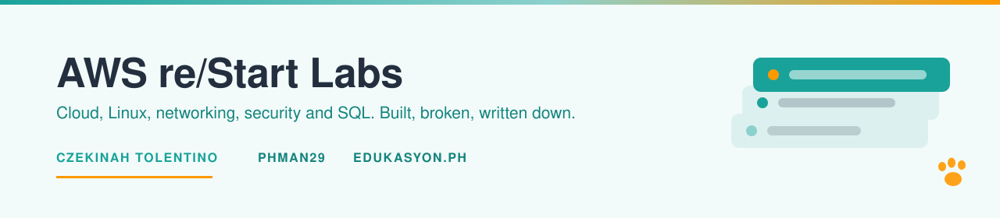

<picture>
  <source media="(prefers-color-scheme: dark)" srcset="assets/banner-dark.svg">
  <source media="(prefers-color-scheme: light)" srcset="assets/banner-light.svg">
  
</picture>

# AWS re/Start labs

    

What I built, what broke, and the one decision in each lab that was worth writing down.

## Deep dives

Seven pieces of work written up properly, with the commands, the transcripts and the failures.

| Lab | The thing worth knowing | Folder |
|---|---|---|
| Private MySQL on RDS | The inbound rule sources from the server's security group, not a CIDR | [`rds-private-mysql/`](rds-private-mysql/) |
| Joins and set operators | A right-table filter in `WHERE` silently turns a `LEFT JOIN` into an inner join | [`sql-multi-table-joins/`](sql-multi-table-joins/) |
| Conditional search | `WHERE` filters rows, `HAVING` filters groups. Swapping them gives a wrong answer, not an error | [`sql-conditional-search/`](sql-conditional-search/) |
| Log growth and retention | `logrotate` with no `create` leaves no active log file behind | [`linux-log-management/`](linux-log-management/) |
| curl and wget | `curl` exits 0 on a 404 unless you pass `--fail` | [`curl-vs-wget/`](curl-vs-wget/) |
| Bash strict mode | `set -e` alone misses a failure mid-pipeline, and `if` switches it off entirely | [`bash-failing-loudly/`](bash-failing-loudly/) |
| Linux paths | Scripts need absolute paths. Prompts do not | [`linux-paths/`](linux-paths/) |

## Coursework

43 labs at 1/1 and 72 knowledge checks at 100%, grouped by track, with the module-by-module record in [`coursework/`](coursework/).

| Track | Labs | Track | Labs |
|---|---|---|---|
| [Linux](coursework/linux/) | 15 | [Security](coursework/security/) | 6 |
| [Databases](coursework/databases/) | 9 | [Python and automation](coursework/python-and-automation/) | 3 |
| [Networking](coursework/networking/) | 7 | [Cloud foundations](coursework/cloud-foundations/) | 2 |
| | | [Systems operations](coursework/systems-operations/) | 1 |

## How to read a deep dive

Four parts every time: what I built, the decision that mattered, the evidence, what broke. SQL and transcripts are committed as files rather than pasted into code blocks, so you can read them or rerun them.

<b>You: why keep the failures in</b>

 

Because the failures are the part that took time. Some of these labs ran clean and taught me nothing I could not have read. The others broke in ways the brief did not mention, and those are the entries I would actually bring to an interview.

> [!NOTE]
> No credentials, key files or account numbers here. See [`.gitignore`](.gitignore).

Delivered through the AWS re/Start programme with [Edukasyon.ph](https://www.edukasyon.ph/aws-re-start). Some lab briefs come from [jjrs07/restart_batch_29_and_30](https://github.com/jjrs07/restart_batch_29_and_30). The work is mine.
