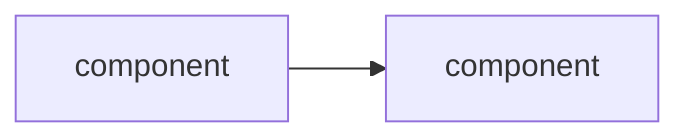

# <Project name>

<Two or three lines: what this builds and the problem it solves.>

## Architecture



## What I built

- <resource, with the setting that mattered>
- <resource>

## The decision that mattered

<The one design choice worth explaining, and why the alternative was worse.>

## Commands

```bash
<the commands I actually ran, in order>
```

## Evidence

| Item | File |
|---|---|
| <what the capture shows> | `<name>.png` |

## What broke

<The failure I hit, what the error said, and what fixed it.>
