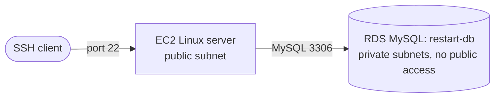

# Private MySQL on RDS, reached from EC2

A managed MySQL database that nothing outside the VPC can reach, queried from an
EC2 Linux server, holding two related tables so a single join answers which
re/Start students have passed the Cloud Practitioner exam.

## Architecture



## What I built

| Component | Setting that mattered |
|---|---|
| RDS instance `restart-db` | MySQL, Dev/Test, single instance with no standby, db.t3.micro, 20 GiB gp2 |
| Network placement | Lab VPC, public access set to No |
| DB subnet group | Spans both private subnets, so RDS has somewhere to place the instance and a failover target |
| Security group | One inbound rule, MySQL/Aurora on 3306, sourced from the Linux server rather than an address range |
| Schema | `RESTART` and `CLOUD_PRACTITIONER`, related on `student_id` |

## The decision that mattered

The security group rule points at the Linux server's security group, not at a
CIDR block. A CIDR rule would keep working if the server were replaced with a
different address, which sounds convenient and is exactly the problem: it opens
the database to anything that later lands in that range. Sourcing from a security
group ties access to identity instead of address, so the rule stays correct when
the network changes and stays narrow when it does not.

The second choice is the schema. `CLOUD_PRACTITIONER` carries only a student ID
and a date. Everything else about the student already lives in `RESTART`, and
duplicating it would let the two tables disagree about the same person. Because
`student_id` is the primary key on `RESTART`, the join has one unambiguous match
on each side and cannot silently multiply rows.

The final query uses an inner join because only students present in both tables
actually sat and passed. A left join would keep the other five and return `NULL`
for the date, which is the version to run when the question is who has not
certified yet.

## Commands

```bash
chmod 400 labsuser.pem
ssh -i labsuser.pem ec2-user@<linux-server-public-ip>

sudo yum install mariadb -y
mysql -h <rds-endpoint> -u <master-user> -p
```

Schema and queries: [`schema.sql`](schema.sql).

Dates are stored as `DATETIME` rather than text, so they sort and compare without
any string handling.

## Evidence

| Item | File |
|---|---|
| `RESTART` created, `DESCRIBE` output | `1.png` |
| Ten student rows inserted | `2.png` |
| `SELECT * FROM RESTART` | `3.png` |
| `CLOUD_PRACTITIONER` created | `4.png` |
| Five certification rows inserted | `5.png` |
| `SELECT * FROM CLOUD_PRACTITIONER` | `6.png` |
| Inner join result | `7.png` |

## What broke

<The failure I hit, what the error said, and what fixed it.>
