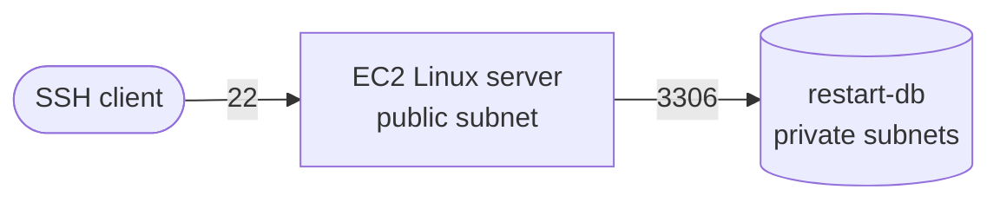

# Private MySQL on RDS, reached from EC2

  

A database nothing outside the VPC can reach, queried from an EC2 instance, with two tables that answer a question neither one answers alone.

## What I built

| Component | Setting that mattered |
|---|---|
| RDS instance | MySQL, Dev/Test, single instance, db.t3.micro, 20 GiB gp2 |
| Placement | Lab VPC, public access **No** |
| Subnet group | Both private subnets, so RDS has a failover target |
| Security group | One rule: 3306, sourced from the server's security group |
| Schema | `RESTART` and `CLOUD_PRACTITIONER`, joined on `student_id` |

Schema and queries: [`schema.sql`](schema.sql).

## The decision that mattered

The inbound rule points at the Linux server's security group, not a CIDR block.

A CIDR rule keeps working when the server is replaced with a different address. That sounds like a feature. It is the bug: the rule now admits anything that later lands in that range. Sourcing from a security group ties access to identity instead of address, so it stays correct when the network changes and stays narrow when it does not.

<b>You: and the schema</b>

 

`CLOUD_PRACTITIONER` carries a student ID and a date, nothing else. Every other detail already lives in `RESTART`, and duplicating it lets the two tables disagree about the same person. `student_id` is the primary key on `RESTART`, so the join has one match per side and cannot multiply rows.

The final query is an inner join because only students in both tables actually passed. A left join keeps the other five with a `NULL` date, which is the version to run when the question is who has **not** certified yet.

## Evidence

Screenshots pending: `1.png` to `7.png`, one per SQL block.

## What broke

Not written yet.
